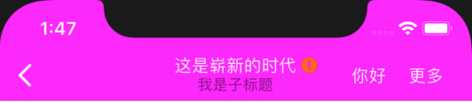
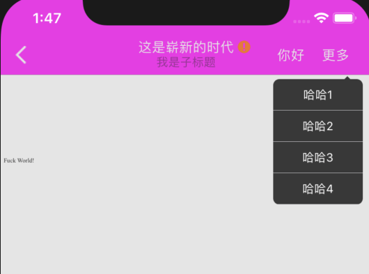

# HybirdCode

基于Hybird实现文件本地化管理。封装的一个webViewController,暴露一些配置参数，实现里面定义好的功能，开放一些功能，但也会有些功能不允许定制的，Controller中注入了JS,能实现原生和HTML相互传值。

## 安装

### 工程配置
1、<key>NSAppTransportSecurity</key>
    <dict>
        <key>NSAllowsArbitraryLoads</key>
        <true/>
    </dict>
2、Build Phases(Build Phases->Link Binary With Libraries)
导入   JavaScriptCore.framework，SystemConfiguration.framework

### 集成步骤：

#### 第一步：
	把demo中的HybirdCodeClass整个文件夹拷贝到工程中即可，不需要自己导入图片了，图片我已经生成在bundle文件中。

#### 第二步：

Podfile中需要导入的文件

  	pod 'UnrarKit'
  	pod 'SSZipArchive'
  	pod 'LzmaSDK-ObjC', :inhibit_warnings => true

## 开始使用

在App启动完成方法中实现下面的方法，这里面的参数，需要服务端提供，详细请参考下面的API。

	[[LazyWebViewManager shareLazyManager] initializeMD5:@"这里是后台返回文件加密的md5值" zipUrl:@"这里是下载zip的url" version:@"这里是后台返回zip的版本号" isFull:NO isUpdate:NO domainName:@"域名" progress:^(NSInteger hasLoadLength, NSInteger totalLengt) {

	 } downLoadSuccess:^{ 

	 }];

导入 #import “LazyWebViewNavBarModel.h”，#import 	“LazyWebViewController.h”。所有的配置都在LazyWebViewNavBarModel这个model中，传入定义好的参数即可。
	
	LazyWebViewController *wkVC = [[LazyWebViewController alloc] init];
	[self.navigationController pushViewController:wkVC animated:YES];

## DEMO

详细的请参考:DEMO

如果右边NavigationBar，需要配置LazyWebViewNavBarModel中rightTitles这个属性，这个值是数组，当只有一个值的时候，是右边只有一个navigationBar,当有两个以上，右边就会显示更多，点击更多，会展开，显示对应的值，会通过代理方法传出来。效果图如下：

## API

在Appdelegate中： #import “LazyWebViewManager.h”  //导入

LazyWebViewManager 是一个单例类

| 参数  | 是否必填  | 描述  |
| ------------ | ------------ | ------------ |
| md5  |  YES | 是初始化时候，zip文件的md5值,这个是服务端返回的，而且必传的一个值  |
| zipUrl  | YES  | zip下载的URL,这个也是服务端返回的  |
| version  | YES  | 这个是本地缓存当前ZIP的版本号，每次更新成功之后，解压之后，保存当前的版本号到本地  |
| isFull  | NO  | 待定  |
| isUpdate  | NO  | 待定  |
| domainName  | YES  | 域名，这个通过服务端返回  |
| hasLoadLength  | NO  | 下载回调的当前进度  |
| totalLengt  | NO  | 回调，当前文字的总长度  |

LazyWebViewNavBarModel

| 参数  | 描述  |
| ------------ | ------------ |
| hiddenNavigationBar  | 是不是显示WebView的NavigationBar  默认是显示  传入YES是隐藏  |
| navBackgroundColor  | WebView的NavigationBar背景色颜色  |
| lineColor  | WebView中加载进度条的颜色  |
| leftNavTitle  | WebView的左边的navigationBar是文字的  |
| leftNavTitleColor  | WebView的左边的navigationBar文字的颜色  ,  这个必须左边是文字的时候，设置才会有效  |
| leftNavImage  | WebView的左边的navigationBar是图标的，默认是白底黑色返回箭头，不是白底，就是白色返回箭头  |
| rightTitles  | 右边的navigationBar ,数组的第一个可以是传入的是图片或者文字，但后面的只能是文字，最多传5个  |
| webTitle  | WebView中的导航条的父title  |
| subwebtitle  | WebView中的导航条的子title  |
| webTitleColor  | webTitleColor 是 父title文字颜色  如果背景是白色，默认黑色  如果背景不是白色  默认白色  |
| webtitleStatus  | 是 导航条父title后面的小图。WebtitleStatusDefault这个是默认，WebtitleStatusExc这个是叹号，WebtitleStatusQues这个是问号  |
| promitString  | 点击小图，弹出的提示文字，文字颜色是白色，背景色是小图的主色值，不能修改  |
| schemeArray  | 白名单跳转的数组，是跳转哪个App,把这个白名单放在这个数组里  |

LazyWebViewController

| 参数  | 是否必传  | 描述  |
| ------------ | ------------ | ------------ |
| delegate  | 是  | 设置代理属性，这个代理里有三个方法，didSelectBackNavigation（点击左上角的NavigationBar的事件），didSelectRightNavigation（点击右边的按钮事件，如果有两个时候，是第一个按钮的点击事件），didSelectNavigationRightBar:(NSInteger)index（    点击右上角的NavigationBar的事件index 是返回点击下标）  |
| urlStr  | 是  | 链接的url   远端的或者本地的HTML  |
| navConfigurateModel  | 否  | 配置文件对应的model  |

### 体系结构（包含哪些主要的类）

1、LazyWebView ：WKWebView类，js交互的都在这个类中。
3、AFNetworkDownLoad  : 下载zip的工具类，通过socket长连接实现下载，同时边下载边记录日志，实现断点续传功能。
4、LazyZipMD5 : 文件夹内容加密，当下载完成zip包之后，加密这个包文件，然后跟服务端给你的MD5比对，这个能判断包文件是否完整，防止解压时zip是包损坏的包。
5、LazyWebViewController ：承载webView的界面，这个是主要的界面，这里面是所有操作交互的核心。

@copyright 2019

